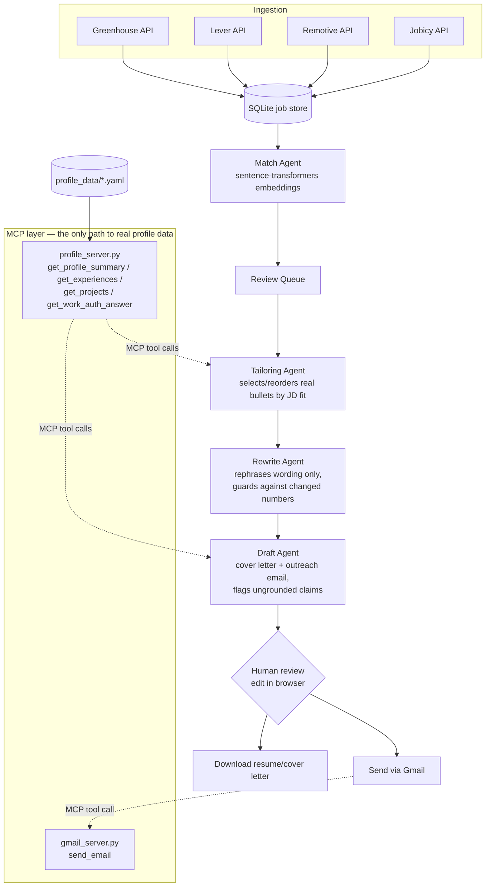

# Jobs AI Agent

An agentic system for job search: it discovers listings across multiple job boards, scores
them against a real candidate profile, tailors a resume and cover letter per job description,
and helps with recruiter outreach — all through a Streamlit dashboard.

The core design constraint driving most of the architecture: **an AI resume tool is only
useful if it never lies about your experience.** Every generation path here is built around
that — grounding agent output in a single verified source of truth, validating it in code
(not just prompting for it), and keeping a human in the loop before anything is sent.

## Architecture



**Two tailoring modes**, chosen automatically based on whether `ANTHROPIC_API_KEY` is set:

- **Local mode** (no API key): `tailor/keyword_tailor.py` — deterministic keyword-overlap
  scoring between the job description and your real bullets. Zero cost, zero API calls, works
  offline.
- **AI mode** (API key present): `tailor/agent.py`'s `TailoringAgent` reads the full job
  description (including any "About the company" section) and selects/orders bullets by
  genuine relevance, `tailor/rewrite_agent.py` rephrases wording to echo the JD's own
  terminology, and `draft/agent.py`'s `DraftAgent` writes a cover letter and outreach emails
  that reference the company's actual stated mission and connect it to real projects.

## Why MCP

Every agent that touches profile data does it through `mcp_servers/profile_server.py` — a
[Model Context Protocol](https://modelcontextprotocol.io/) server that loads
`profile_data/*.yaml` once and exposes it as tools (`get_profile_summary`, `get_experiences`,
`get_projects`, `get_work_auth_answer`). Agents call these tools via `candidate/mcp_client.py`
instead of importing the YAML directly.

This isn't agent-to-agent communication — the servers are plain deterministic Python (read a
file, send an email), not autonomous agents. What MCP buys here is a **single, structured
access boundary**: because there's exactly one path real data can take into an agent's prompt,
the fabrication guardrails below only have to trust that one path, instead of every place in
the codebase that might read profile data.

Outbound Gmail sending goes through the same pattern (`mcp_servers/gmail_server.py`), so the
send action is a tool call an agent/UI invokes explicitly — not something baked into the
generation step.

## The fabrication guardrails (the part that actually enforces "no lying")

Prompts *ask* the model not to invent things. That's necessary but not sufficient — the real
guarantees are enforced in code:

| Task | Mechanism | Where |
|---|---|---|
| Bullet **selection** | Every bullet Claude returns is checked against the real bullet set fetched via MCP; any non-verbatim match raises an error and falls back to returning your real bullets directly | `tailor/agent.py::_validate_no_fabrication` |
| Bullet **rewriting** | Numbers/percentages are extracted from the original and the rewrite and compared; any mismatch discards the rewrite and keeps your original wording | `tailor/rewrite_agent.py::_numbers` |
| Free-text generation (cover letters, outreach emails) | Prompt requires an explicit `[NEEDS HUMAN REVIEW — not grounded in profile KB]` marker on any ungrounded claim; occurrences are logged | `draft/agent.py` |
| Work-authorization answers | Never generated — always echoed verbatim from `work_auth.yaml` via a locked lookup | `mcp_servers/profile_server.py::get_work_auth_answer` |
| CI gate | `eval/harness.py` re-checks faithfulness, tailoring relevance, and work-auth integrity; wired as a required step in `.github/workflows/ci.yml` | `eval/harness.py` |

Nothing is ever sent or downloaded without a human seeing it first — every generated
resume/cover letter/outreach email opens in an editable text box with an explicit
review-and-confirm step before the Send button is even clickable.

## Repository layout

```
app/            Streamlit dashboard — the only UI, 4 tabs (Discover, Review Queue,
                Tailor & Draft, My Profile)
core/           Pydantic schemas (Job, Profile) and storage (SQLite via SQLAlchemy)
ingestion/      Adapters for Greenhouse, Lever, Remotive, Jobicy job APIs
candidate/      Profile knowledge base loader + the MCP client agents use to read it
match/          Semantic match scoring (sentence-transformers embeddings, local, free)
tailor/         keyword_tailor.py (free/local) and agent.py + rewrite_agent.py (AI mode)
draft/          Cover letter and recruiter-outreach-email generation (grounded, flagged)
outreach/       Recruiter discovery helpers (LinkedIn search links, company-site lookup)
                and the Gmail MCP client
mcp_servers/    profile_server.py and gmail_server.py — the two MCP tool servers
orchestrator/   LangGraph state-machine pipeline (match → tailor → draft → human review).
                Defines the same flow as an importable async pipeline; the Streamlit app
                currently calls the tailor/draft agents directly rather than through this
                graph — kept as the reusable pipeline definition for non-UI use (CLI, batch).
profile_data/   Your real profile as YAML (gitignored where sensitive — see below)
eval/           Faithfulness/relevance eval harness, run as a CI gate
fill/           Placeholder for future ATS auto-fill — not yet implemented
tests/          pytest suite (no live LLM calls)
```

## Setup

```bash
git clone <this repo>
cd Jobs_AI_Agent
python3.11 -m venv .venv
.venv/bin/pip install -e ".[dev]"
```

Copy the example config files and fill in your real values:

```bash
cp .env.example .env
cp profile_data/meta.example.yaml profile_data/meta.yaml
cp profile_data/work_auth.example.yaml profile_data/work_auth.yaml
```

Then edit `profile_data/*.yaml` with your real experience, projects, education, and skills —
these files are the only source of truth agents are allowed to draw from.

`.env` variables:

| Variable | Required? | Purpose |
|---|---|---|
| `ANTHROPIC_API_KEY` | No | Enables AI-mode tailoring, drafting, and rewriting. Without it, the app runs entirely in free local/keyword mode. |
| `GMAIL_ADDRESS` / `GMAIL_APP_PASSWORD` | No | Enables sending recruiter outreach emails from the app. Requires a Gmail [App Password](https://myaccount.google.com/apppasswords) (needs 2-Step Verification on), not your regular password. |
| `DATABASE_URL`, `CHROMA_PERSIST_DIR` | No | Default to local SQLite/Chroma — override for a different backend. |
| `USAJOBS_API_KEY`, `SLACK_WEBHOOK_URL` | No | Optional integrations, unused by default. |

## Running it

```bash
./run.sh
```

This is `.venv/bin/streamlit run app/main.py`. First launch installs/imports
`sentence-transformers` (used for semantic match scoring) lazily on your first search — this
can take a while depending on your machine and network, but only happens once per process.

## Testing

```bash
.venv/bin/pytest tests/ -v
.venv/bin/python -m eval.harness
```

Both run in CI (`.github/workflows/ci.yml`) on every push/PR to `main`, alongside `ruff` for
linting and `mypy` (advisory) for type checking. Unit tests use a dummy API key and never make
live LLM calls.

## Tech stack

Python 3.11 · Streamlit · LangGraph · Anthropic Claude API · MCP · sentence-transformers ·
ChromaDB · SQLAlchemy/SQLite · httpx · Pydantic
